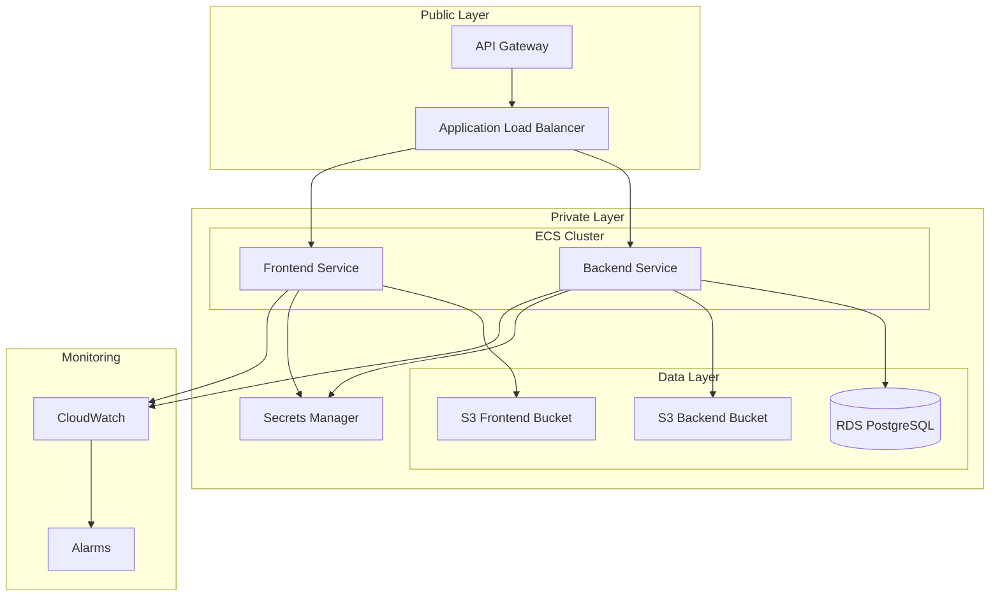

# 🚀 AWS Infrastructure with Terraform

[](https://www.terraform.io/)
[](https://aws.amazon.com/)
[](https://www.docker.com/)
[](LICENSE)

> **Minimal-cost, serverless AWS infrastructure** built with Terraform, featuring ECS Fargate, RDS PostgreSQL, S3, API Gateway, CloudWatch, and Secrets Manager with automated deployment scripts and .env file generation.

## 📋 Table of Contents

- [Overview](#-overview)
- [Architecture](#-architecture)
- [Features](#-features)
- [Prerequisites](#-prerequisites)
- [Quick Start](#-quick-start)
- [Folder Structure](#-folder-structure)
- [Usage Guide](#-usage-guide)
- [Scripts](#-scripts)
- [Modules](#-modules)
- [Cost Analysis](#-cost-analysis)
- [Security](#-security)
- [Troubleshooting](#-troubleshooting)
- [Contributing](#-contributing)
- [License](#-license)

## 🎯 Overview

This project provides a complete, production-ready AWS infrastructure setup using Terraform. It's designed for minimal cost while maintaining high availability, security, and scalability. Perfect for startups, small businesses, or developers who want a robust cloud infrastructure without breaking the bank.

### What's Included

- **🏗️ Infrastructure as Code**: Complete Terraform configuration
- **🐳 Container Orchestration**: ECS Fargate for backend and frontend
- **🗄️ Database**: RDS PostgreSQL with automated backups
- **📦 Storage**: S3 buckets with lifecycle policies
- **🌐 API Gateway**: HTTP API with routing and CORS
- **🔐 Security**: IAM roles, Secrets Manager, VPC isolation
- **📊 Monitoring**: CloudWatch dashboards and alarms
- **🚀 Automation**: Deployment and destroy scripts
- **📝 Environment Management**: Automatic .env file generation

## 🏗️ Architecture



### Infrastructure Components

| Service | Purpose | Cost (Monthly) |
|---------|---------|----------------|
| **ECS Fargate** | Container orchestration | ~$10-20 |
| **RDS PostgreSQL** | Database | ~$15 |
| **S3** | File storage | ~$0.50 |
| **API Gateway** | HTTP API | ~$3.50 |
| **Secrets Manager** | Credential management | ~$0.40 |
| **CloudWatch** | Monitoring | ~$0.50 |
| **VPC & Networking** | Network isolation | Free tier |

**Total Estimated Cost: ~$30/month** (with moderate usage)

## ✨ Features

### 🔒 Security First
- **VPC Isolation**: Private subnets for sensitive resources
- **IAM Least Privilege**: Minimal required permissions
- **Secrets Manager**: Secure credential storage
- **Encryption**: Data encrypted at rest and in transit
- **Security Groups**: Network-level access control

### 💰 Cost Optimized
- **Free Tier Friendly**: Leverages AWS free tier limits
- **Auto Scaling**: Scale to zero when not in use
- **Lifecycle Policies**: Automatic data archival
- **Resource Optimization**: Right-sized instances

### 🚀 Developer Friendly
- **One-Command Deployment**: `./scripts/deploy.sh`
- **Automatic .env Generation**: `./scripts/generate_env.sh`
- **Environment Management**: Dev/Prod separation
- **State Backup**: Automatic Terraform state backups

### 📊 Production Ready
- **High Availability**: Multi-AZ deployment
- **Monitoring**: CloudWatch dashboards and alarms
- **Backup Strategy**: Automated database backups
- **Logging**: Centralized log management

## 📋 Prerequisites

### Required Software
```bash
# Terraform (>= 1.0)
brew install terraform  # macOS
# or download from https://www.terraform.io/downloads

# AWS CLI
brew install awscli     # macOS
# or download from https://aws.amazon.com/cli/

# jq (for .env generation)
brew install jq         # macOS
sudo apt-get install jq # Ubuntu/Debian
```

### AWS Account Setup
```bash
# Configure AWS credentials
aws configure

# Verify access
aws sts get-caller-identity
```

### Required Permissions
Your AWS user/role needs permissions for:
- ECS, RDS, S3, API Gateway, CloudWatch, Secrets Manager
- IAM (for creating roles and policies)
- VPC, EC2 (for networking)

## 🚀 Quick Start

### 1. Clone and Setup
```bash
git clone https://github.com/yourusername/aws-infrastructure.git
cd aws-infrastructure

# Copy configuration template
cp terraform/terraform.tfvars.example terraform/terraform.tfvars

# Edit configuration
nano terraform/terraform.tfvars
```

### 2. Set Environment Variables
```bash
export TF_VAR_db_username=myuser
export TF_VAR_db_password=mypassword123
```

### 3. Deploy Infrastructure
```bash
# Deploy to dev environment
./scripts/deploy.sh -e dev -a

# Or deploy to production
./scripts/deploy.sh -e prod -a
```

### 4. Generate .env File
```bash
# Generate .env file from Secrets Manager
./scripts/generate_env.sh -e dev
```

### 5. Access Your Application
```bash
# Get API Gateway URL
cd terraform && terraform output api_gateway_url

# Get CloudWatch Dashboard
terraform output cloudwatch_dashboard_url
```

## 📁 Folder Structure

```
aws-infrastructure/
├── 📁 terraform/                    # Main Terraform configuration
│   ├── 📁 modules/                  # Reusable Terraform modules
│   │   ├── 📁 vpc/                  # VPC, subnets, security groups
│   │   ├── 📁 iam/                  # IAM roles and policies
│   │   ├── 📁 rds/                  # PostgreSQL database
│   │   ├── 📁 s3/                   # S3 buckets and policies
│   │   ├── 📁 ecr/                  # Docker image repositories
│   │   ├── 📁 ecs/                  # ECS cluster and services
│   │   ├── 📁 apigateway/           # HTTP API Gateway
│   │   ├── 📁 cloudwatch/           # Monitoring and alarms
│   │   └── 📁 secretsmanager/       # Secret storage
│   ├── main.tf                      # Main configuration
│   ├── variables.tf                 # Input variables
│   ├── outputs.tf                   # Output values
│   ├── provider.tf                  # AWS provider configuration
│   └── terraform.tfvars.example     # Configuration template
├── 📁 scripts/                      # Automation scripts
│   ├── deploy.sh                    # Infrastructure deployment
│   ├── destroy.sh                   # Infrastructure destruction
│   ├── generate_env.sh              # .env file generation
│   └── README.md                    # Script documentation
├── 📁 docs/                         # Documentation
│   ├── folder-structure.md          # Detailed folder structure
│   ├── rfc.md                       # Requirements specification
│   └── workflow.md                  # Development workflow
├── 📁 backups/                      # Terraform state backups
├── 📁 logs/                         # Script execution logs
├── .env                             # Generated environment file
├── .gitignore                       # Git ignore rules
└── README.md                        # This file
```

## 📖 Usage Guide

### Environment Management

#### Development Environment
```bash
# Deploy dev environment
./scripts/deploy.sh -e dev -a

# Generate dev .env file
./scripts/generate_env.sh -e dev

# Destroy dev environment
./scripts/destroy.sh -e dev
```

#### Production Environment
```bash
# Deploy production environment
./scripts/deploy.sh -e prod -a

# Generate production .env file
./scripts/generate_env.sh -e prod

# Destroy production (use with caution!)
./scripts/destroy.sh -e prod -f
```

### Application Deployment

#### 1. Build and Push Docker Images
```bash
# Build your application images
docker build -t your-backend:latest ./backend
docker build -t your-frontend:latest ./frontend

# Get ECR repository URLs
cd terraform && terraform output ecr_repository_urls

# Push to ECR
aws ecr get-login-password --region eu-central-1 | docker login --username AWS --password-stdin YOUR_ACCOUNT.dkr.ecr.eu-central-1.amazonaws.com
docker tag your-backend:latest YOUR_ACCOUNT.dkr.ecr.eu-central-1.amazonaws.com/aws-infrastructure-dev-backend:latest
docker push YOUR_ACCOUNT.dkr.ecr.eu-central-1.amazonaws.com/aws-infrastructure-dev-backend:latest
```

#### 2. Update ECS Services
```bash
# Update task definitions with new images
aws ecs update-service --cluster aws-infrastructure-dev-cluster --service aws-infrastructure-dev-backend --force-new-deployment
```

### Environment Variables

The `.env` file contains all necessary configuration:

```bash
# Database Configuration
db_host=your-rds-endpoint.region.rds.amazonaws.com
db_port=5432
db_name=appdb
db_username=myuser
db_password=mypassword123

# S3 Bucket Information
s3_backend_bucket_name=aws-infrastructure-dev-backend-storage
s3_frontend_bucket_name=aws-infrastructure-dev-frontend-storage
s3_backend_bucket_arn=arn:aws:s3:::aws-infrastructure-dev-backend-storage
s3_frontend_bucket_arn=arn:aws:s3:::aws-infrastructure-dev-frontend-storage

# Environment Information
environment=dev
project=aws-infrastructure
region=eu-central-1
```

## 🔧 Scripts

### Deployment Script (`deploy.sh`)
```bash
# Basic usage
./scripts/deploy.sh

# With options
./scripts/deploy.sh -e prod -a -n

# Options:
# -e, --environment ENV    Environment (dev/prod) [default: dev]
# -a, --auto-approve      Auto-approve changes
# -p, --plan-only         Only create plan, don't apply
# -n, --no-backup         Don't backup Terraform state
# -h, --help              Show help
```

### Destroy Script (`destroy.sh`)
```bash
# Safe destroy (with confirmation)
./scripts/destroy.sh -e dev

# Force destroy
./scripts/destroy.sh -e dev -f

# Options:
# -e, --environment ENV    Environment (dev/prod) [default: dev]
# -a, --auto-approve      Auto-approve destroy
# -p, --plan-only         Only create destroy plan
# -f, --force             Skip confirmation prompts
# -h, --help              Show help
```

### Environment Generator (`generate_env.sh`)
```bash
# Generate .env file
./scripts/generate_env.sh -e dev

# Force overwrite existing .env
./scripts/generate_env.sh -e dev -f

# Options:
# -e, --environment ENV    Environment (dev/prod) [default: dev]
# -p, --project NAME       Project name
# -s, --secret-name NAME   Custom secret name
# -r, --region REGION      AWS region
# -f, --force             Force overwrite .env file
# -h, --help              Show help
```

## 🧩 Modules

### VPC Module
- **Purpose**: Network isolation and security
- **Features**: Public/private subnets, NAT Gateway, security groups
- **Outputs**: VPC ID, subnet IDs, security group IDs

### IAM Module
- **Purpose**: Access control and permissions
- **Features**: ECS task roles, RDS access, API Gateway execution
- **Security**: Least privilege principle

### RDS Module
- **Purpose**: PostgreSQL database
- **Features**: Multi-AZ, automated backups, encryption
- **Cost**: Optimized for free tier usage

### S3 Module
- **Purpose**: File storage for applications
- **Features**: Versioning, lifecycle policies, encryption
- **Buckets**: Separate buckets for backend and frontend

### ECR Module
- **Purpose**: Docker image storage
- **Features**: Image scanning, lifecycle policies
- **Repositories**: Backend and frontend image repositories

### ECS Module
- **Purpose**: Container orchestration
- **Features**: Fargate, auto-scaling, load balancing
- **Services**: Backend and frontend services

### API Gateway Module
- **Purpose**: HTTP API and routing
- **Features**: CORS, rate limiting, HTTPS
- **Routing**: `/api/*` to backend, others to frontend

### CloudWatch Module
- **Purpose**: Monitoring and alerting
- **Features**: Dashboards, alarms, log aggregation
- **Metrics**: CPU, memory, request count

### Secrets Manager Module
- **Purpose**: Secure credential storage
- **Features**: Automatic rotation, encryption
- **Content**: Database credentials, S3 info, environment data

## 💰 Cost Analysis

### Free Tier Usage (First 12 Months)
| Service | Free Tier | Monthly Cost |
|---------|-----------|--------------|
| ECS Fargate | 50 hours/month | $0 |
| RDS PostgreSQL | 750 hours/month | $0 |
| S3 | 5GB/month | $0 |
| API Gateway | 1M calls/month | $0 |
| Secrets Manager | 30 days/secret | $0 |
| CloudWatch | 5GB/month | $0 |

### Post-Free Tier (Typical Usage)
| Service | Usage | Monthly Cost |
|---------|-------|--------------|
| ECS Fargate | 730 hours | $10-20 |
| RDS PostgreSQL | 730 hours | $15 |
| S3 | 10GB | $0.50 |
| API Gateway | 1M calls | $3.50 |
| Secrets Manager | 1 secret | $0.40 |
| CloudWatch | 10GB | $0.50 |
| **Total** | | **~$30** |

### Cost Optimization Tips
1. **Use Spot Instances**: For non-critical workloads
2. **Right-size Resources**: Monitor and adjust instance sizes
3. **Enable Auto-scaling**: Scale to zero when not in use
4. **Use Lifecycle Policies**: Archive old data to cheaper storage
5. **Monitor Usage**: Set up billing alerts

## 🔒 Security

### Network Security
- **VPC Isolation**: All resources in private subnets
- **Security Groups**: Minimal required access
- **NAT Gateway**: Outbound internet access only
- **API Gateway**: Public endpoint with HTTPS

### Access Control
- **IAM Roles**: Service-specific permissions
- **Least Privilege**: Minimal required access
- **Secret Rotation**: Automatic credential rotation
- **Encryption**: Data encrypted at rest and in transit

### Compliance
- **Audit Logging**: CloudTrail enabled
- **Backup Encryption**: Automated encrypted backups
- **Access Monitoring**: CloudWatch alarms for suspicious activity

## 🛠️ Troubleshooting

### Common Issues

#### 1. Terraform State Lock
```bash
# Check for state locks
terraform force-unlock <LOCK_ID>

# Or destroy and recreate
rm .terraform/terraform.tfstate
terraform init
```

#### 2. AWS Credentials
```bash
# Verify credentials
aws sts get-caller-identity

# Check permissions
aws iam get-user
```

#### 3. Resource Limits
```bash
# Check service quotas
aws service-quotas get-service-quota --service-code ecs --quota-code L-21C621EB
```

#### 4. Network Issues
```bash
# Check VPC configuration
aws ec2 describe-vpcs
aws ec2 describe-subnets
```

### Debug Commands

#### Check Infrastructure Status
```bash
# List all resources
cd terraform && terraform state list

# Show outputs
terraform output

# Check specific resource
terraform show -json | jq '.values.root_module.resources[] | select(.name == "aws_ecs_cluster")'
```

#### Monitor Application
```bash
# Check ECS services
aws ecs describe-services --cluster aws-infrastructure-dev-cluster

# Check RDS status
aws rds describe-db-instances --db-instance-identifier aws-infrastructure-dev-db

# Check API Gateway
aws apigatewayv2 get-apis
```

#### Log Analysis
```bash
# View CloudWatch logs
aws logs describe-log-groups
aws logs filter-log-events --log-group-name /aws/ecs/aws-infrastructure-dev
```

## 🤝 Contributing

We welcome contributions! Please follow these steps:

1. **Fork the repository**
2. **Create a feature branch**: `git checkout -b feature/amazing-feature`
3. **Make your changes**
4. **Test thoroughly**: Run `./scripts/deploy.sh -e dev -p`
5. **Commit your changes**: `git commit -m 'Add amazing feature'`
6. **Push to the branch**: `git push origin feature/amazing-feature`
7. **Open a Pull Request**

### Development Guidelines
- Follow Terraform best practices
- Add proper documentation
- Include tests for new modules
- Update cost analysis if needed
- Ensure security best practices

### Testing
```bash
# Test deployment
./scripts/deploy.sh -e dev -p

# Test destroy
./scripts/destroy.sh -e dev -p

# Test .env generation
./scripts/generate_env.sh -e dev
```

## 📄 License

This project is licensed under the MIT License - see the [LICENSE](LICENSE) file for details.

## 🙏 Acknowledgments

- [Terraform Documentation](https://www.terraform.io/docs)
- [AWS Well-Architected Framework](https://aws.amazon.com/architecture/well-architected/)
- [HashiCorp Best Practices](https://www.terraform.io/docs/cloud/guides/recommended-practices/index.html)

## 📞 Support

- **Issues**: [GitHub Issues](https://github.com/yourusername/aws-infrastructure/issues)
- **Discussions**: [GitHub Discussions](https://github.com/yourusername/aws-infrastructure/discussions)
- **Documentation**: [Wiki](https://github.com/yourusername/aws-infrastructure/wiki)

---

<div align="center">

**Made with ❤️ for the AWS community**

[](https://github.com/yourusername/aws-infrastructure/stargazers)
[](https://github.com/yourusername/aws-infrastructure/network)
[](https://github.com/yourusername/aws-infrastructure/issues)

</div>
